# CLI Meeting Planner - Kodehode backend task

## Datamodell

## Optional - WIP
The following diagram (or its [unprocessed Mermaid markup](./README.template.md)) contains an optional step in the main task.

**N.B** While this diagram may exist it does not guarantee that the underlying implementation adheres to it.

### Notes
While Github is able to render embedded mermaid diagrams, a template is still used for non github hosted repositories