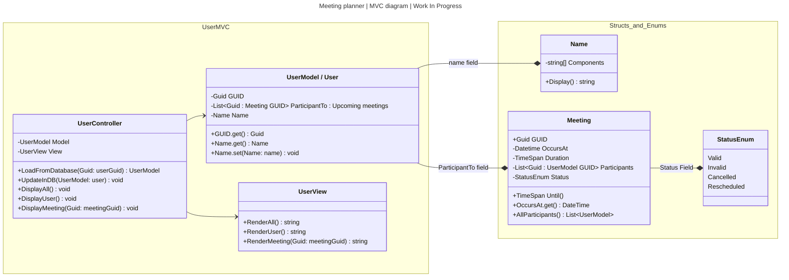

# CLI Meeting Planner - Kodehode backend task

## Optional
The following diagram (or its [unprocessed Mermaid markup](./README.template.md)) contains an optional step in the main task.

While the MVC pattern is *going* to be used extensively in future tasks, for a CLI application
it complicates development, slows down productivity, and does not guarantee flexibility.
The MVC pattern becomes more reasonable once business logic complexity grows. 
